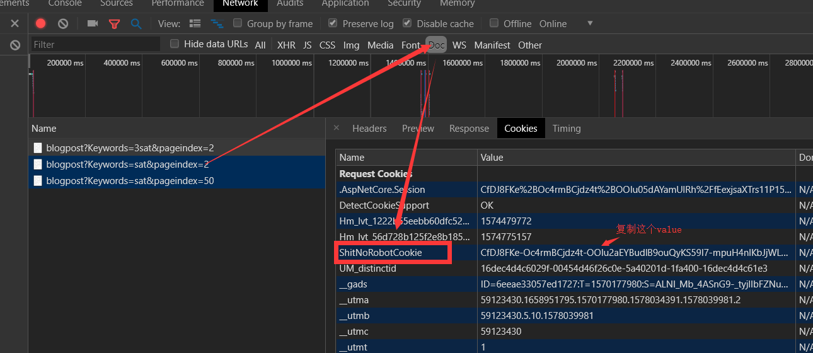
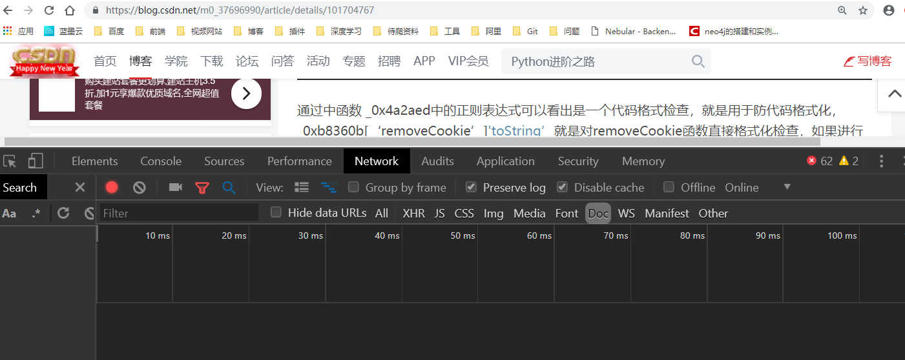
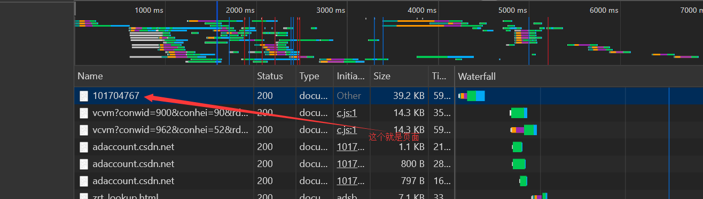
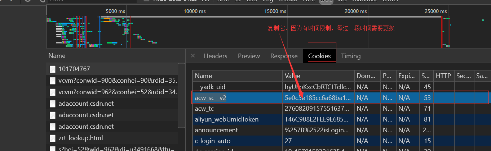

### 博客园爬虫

- 用途：

  用于爬取博客园中博客的内容

- 提交者：

  陈焕

### 博客园搜索爬虫

- 用途：
- 用于博客园搜索结果爬取
- 提交者：
- 陈焕
- 注意事项：博客园搜索有滑动验证，验证成功后返回一个cookie叫：ShitNoRobotCookie（这个cookie测试过持续时间比较长所以暂时就不用破解），使用时需要事先改动这个cookie（也就是先人工浏览一下再用爬虫访问），下为过程：
- 

### CSDN爬虫

- 用途:

  用于爬取CSDN博客上的博文内容

- 提交者：

  陈焕

- 注意事项：

  使用前需要获取cookie中的acw_sc__v2加密码（暂时没破解，因为溯源会进入debug黑洞，比较麻烦，待完善）

  获取方式如下：

  - 
  - 打开CSDN博文，Network模式下DOC，先Clear再刷新页面
  - 
  - 找到第一个纯数字的那个doc，点开，cookie下找到
  - 
  - 找到acw_sc__v2的value，加到header中的cookie中去，即可用爬虫得到真实页面

  ### CSDN 搜索爬虫

  - 用途：
  
    用于爬取CSDN搜索结果爬取
  
  - 提交者
  
    陈焕
  
  
  ### 简书爬虫
  
  - 用途：
  
    用于爬取简书博客上的博文内容
  
  - 提交者
  
    陈焕
  
  - 注意事项：
  
    图片顺序和文字在某些特定的情况下可能会存在对不牢的情况，需使用者自行判断
  
  ### 简书搜索爬虫
  
  - 用途：
  
    用于爬取简书搜索结果爬取
  
  - 提交者
  
    陈焕
  
  - 注意事项：
  
    这里边有个加密码，通过事先搜索获取，暂时破解成功，不确定是否会改变
  
  