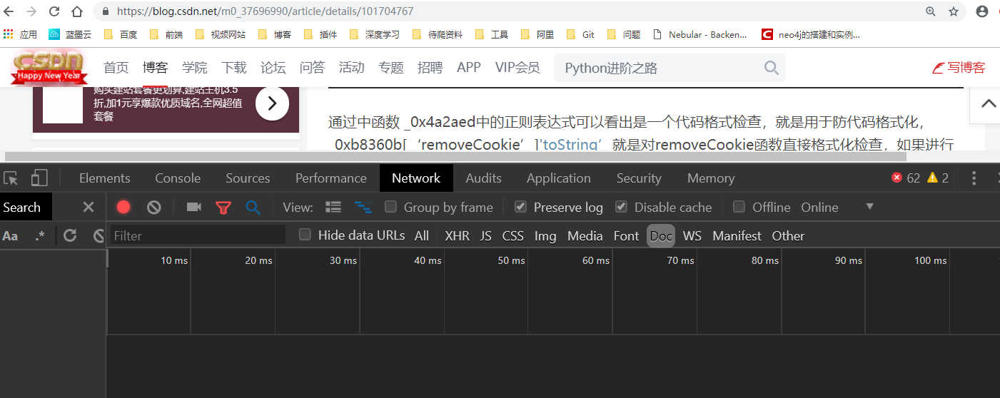
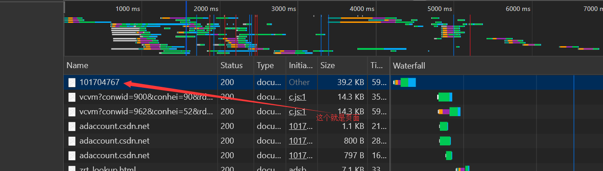
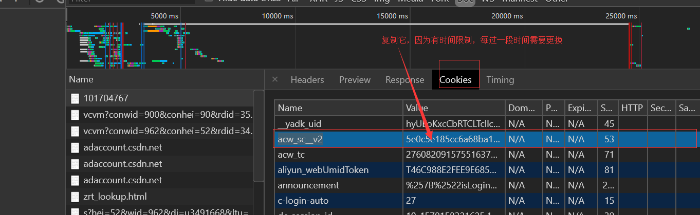

### CSDN爬虫

- 用途:

  用于爬取CSDN博客上的博文内容

- 提交者：

  陈焕

- 注意事项：

  使用前需要获取cookie中的acw_sc__v2加密码（暂时没破解）

  获取方式如下：

  - 
  - 打开CSDN博文，Network模式下DOC，先Clear再刷新页面
  - 
  - 找到第一个纯数字的那个doc，点开，cookie下找到
  - 
  - 找到acw_sc__v2的value，加到header中的cookie中去，即可用爬虫得到真实页面

  

  